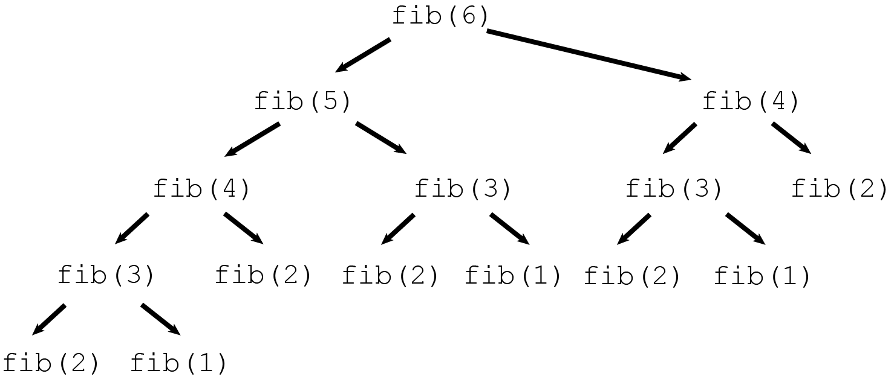

# Fibonacci Series

Fibonacci sequence, in which each number is the sum of the two preceding ones. The sequence commonly starts from 0 and 1, although some authors start the sequence from 1 and 1 or sometimes (as did Fibonacci) from 1 and 2. Starting from 0 and 1, the first few values in the sequence are:

```
0, 1, 1, 2, 3, 5, 8, 13, 21, 34, 55, 89, 144.
```

# Approach

### Iterative Approach

```c
long long int iterative_fibo(long long int n) {
  long long int a = 0;
  long long int b = 1;
  long long int output;

  if (n == 0) {
    return 0;
  }

  if (n == 1) {
    return 1;
  }

  long long int i;
  for (i = 2; i <= n; i++)
  {
    output = a + b;
    a = b;
    b = output;
  }

  return output;
}

```

### Recursive Approach

```c

long long int recursive_fibo(long long int n)
{
  if (n == 0) {
    return 0;
  }

  if (n == 1) {
    return 1;
  }

  return recursive_fibo(n - 1) + recursive_fibo(n - 2);
}

```

# Testing

In this section, we will run the test code to compare the result of two different approach (iterative and recursive).

Command to compile the `main_test.c` code
```
gcc -o main_test.exe main_test.c mylib/mylib.c
```

Command to run the `main_text.exe`
```
main_test
```

To make the testing process easier, every single loop to find the next fibonacci number, we compare both result using assert.
Here is the snippet output of the test. The program compares the 1st to the 40th fibonacci number produce by both approach.
But to make the notes much simpler, I only show the last 5 fibonacci number output which is the 36th to 40th fibonacci number.

```
fibo(36):
Iterative: 14930352; Recursive: 14930352

fibo(37):
Iterative: 24157817; Recursive: 24157817

fibo(38):
Iterative: 39088169; Recursive: 39088169

fibo(39):
Iterative: 63245986; Recursive: 63245986

fibo(40):
Iterative: 102334155; Recursive: 102334155
```

# Benchmarking

## Time complexity

### Iterative Approach Time Complexity

Command to compile the `main_b_time_iterative.c` code:
```
gcc -o main_b_time_iterative.exe main_b_time_iterative.c mylib/mylib.c
```

Command to run the `main_b_time_iterative.exe` program
```
main_b_time_iterative
```

Here is the output of the `main_b_time_iterative.exe` program

```
Time elapsed finding fibo number 0 to 40: 0.000000000000 seconds
```

The amount of time needed is very small, nearly 0 seconds.

### Recursive Approach Time Complexity

Command to compile the `main_b_time_recursive.c` code:
```
gcc -o main_b_time_recursive.exe main_b_time_recursive.c mylib/mylib.c
```

Command to run the `main_b_time_recursive.exe` program
```
main_b_time_recursive
```

Here is the output of the `main_b_time_recursive.exe` program

```
Time elapsed finding fibo number 0 to 40: 4.381999969482 seconds
```

The amount of time needed is very small, nearly 4.382 seconds.

## Space complexity

### Iterative Approach Space Complexity

Command to compile the `main_b_time_iterative.c` code:
```
gcc -o main_b_space_iterative.exe main_b_space_iterative.c mylib/mylib.c
```

Command to run the `main_b_space_iterative.exe` program
```
main_b_space_iterative
```

Here is the memory usage of iterative apporach, tested on calculating the 40th fibonacci number.


The amount of memory consumed when running this program is 408K.

### Recursive Approach Time Complexity

Command to compile the `main_b_space_recursive.c` code:
```
gcc -o main_b_space_recursive.exe main_b_space_recursive.c mylib/mylib.c
```

Command to run the `main_b_space_recursive.exe` program
```
main_b_space_recursive
```

Here is the memory usage of recursive apporach, tested on calculating the 40th fibonacci number.


The amount of memory consumed when running this program is 476K.

# Conclusion

Based on the amount of time needed to find 1th fibonacci number to the 40th fibonacci number, **Iterative approach is way faster compare to Recursive approach.**

Why?



The above image shows the process of how to find the 6th fibonacci number in fibonacci series. We can see that there are many redundant function doing the same thing (finding the nth fibonacci number). For example the function `fibo(2)` is being called for 5 times. This will increase the amount of time needed to find the fibonacci number, because there are a lot of repetitive process. This also increase the amount of memory needed when computing the fibonacci number, because the function will not be resolved until it reach the base case. So the function will be put into the stack process, which will also increase the space complexity. Additionally, the amount of memory used when allocating the variable to store the value is also increasing.
